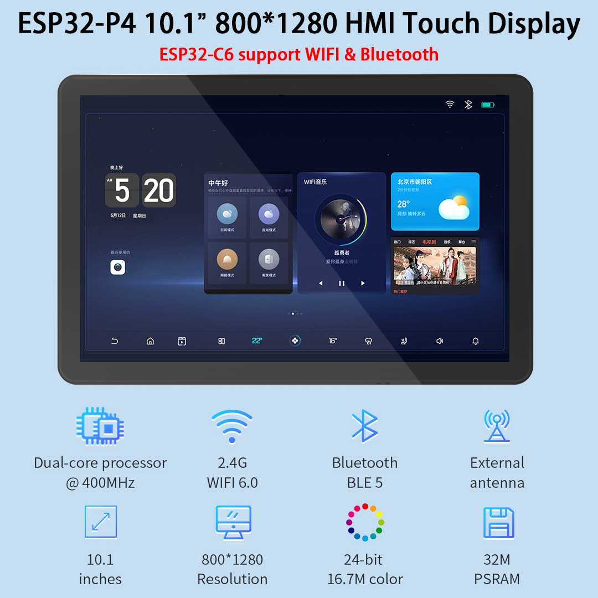
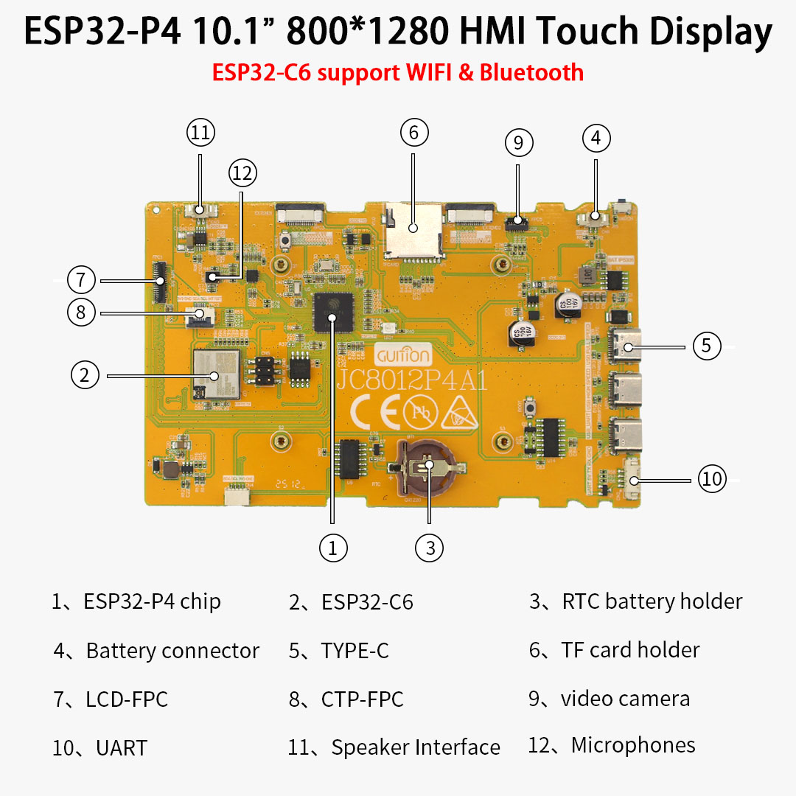
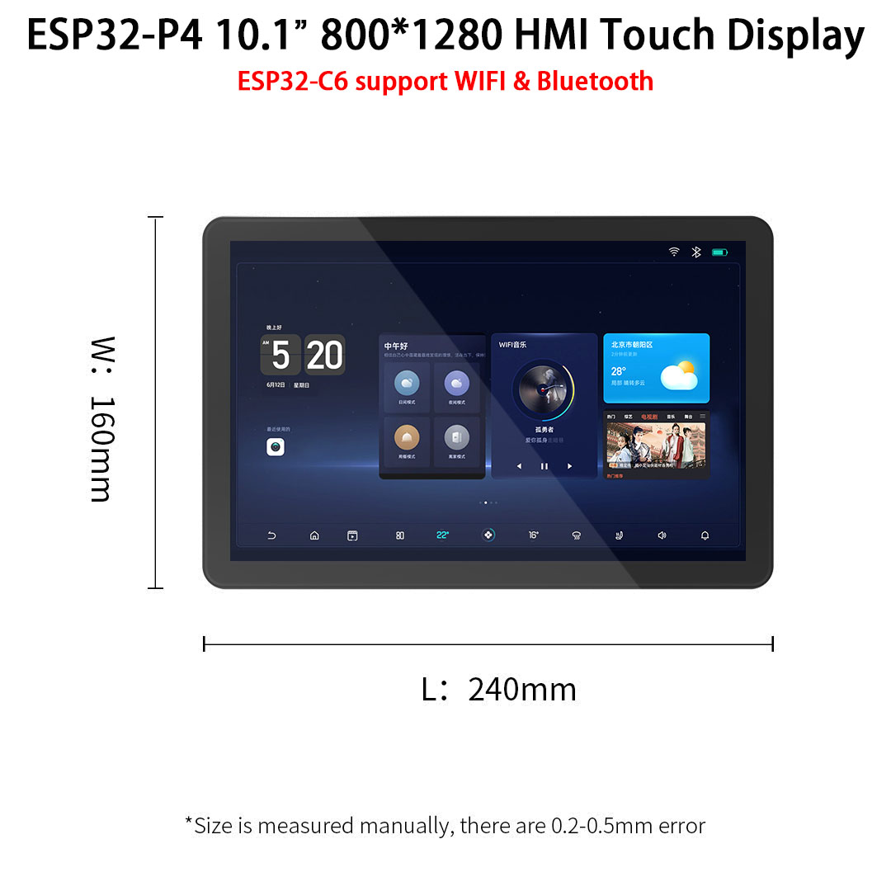
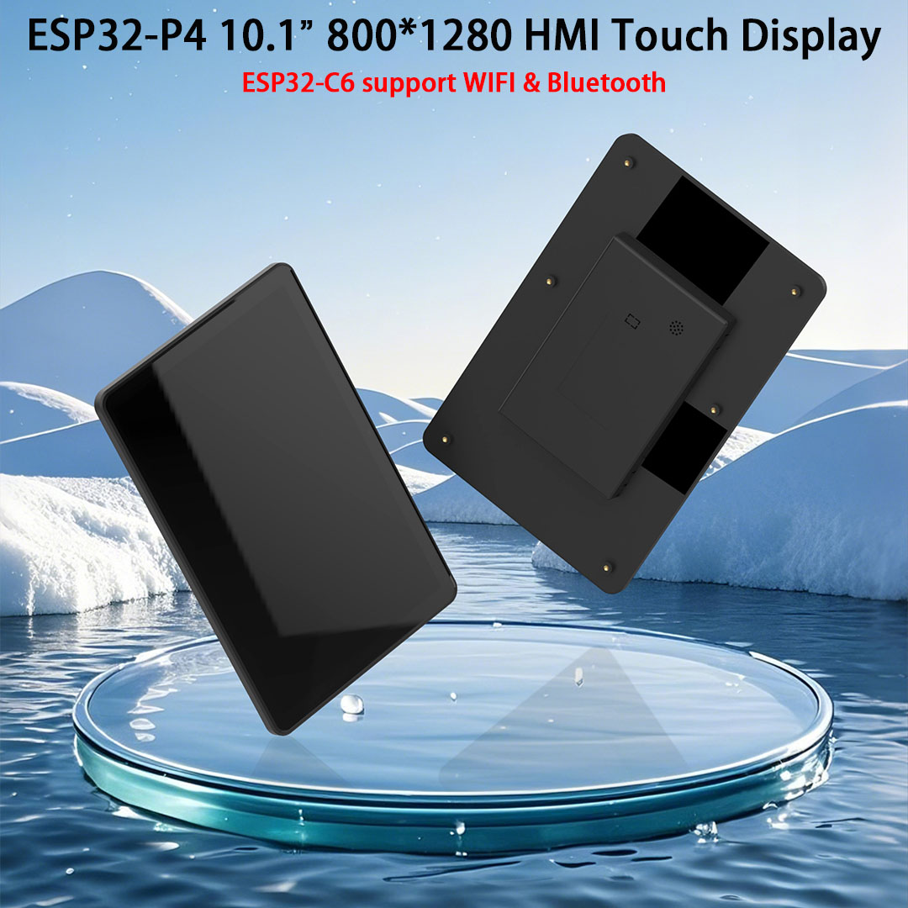

# GUITION ESP32-P4 + ESP32-C6 with 10.1" touch display (JC8012P4A1C-I-W-Y1)

## Overview
JC8012P4A1 use ESP32-P4NRW32 & ESP32-C6-MINI-1U-N4 as the controller, the main controller(ESP32-P4NRW32) is a dual-core MCU, ESP32-C6-MINI-1U-N4 integrated WI-FI and Bluetooth functions, the main frequency can reach 400MHz, 768KB_HP 16KB_LP SRAM, 128KB ROM, 32M PSRAM, Flash size is 16MB, 10.1 inch display resolution is 800*1280, with Capacitive Touch Panel.

The module includes LCD display screen, backlight control circuit, touch screen control circuit.

Reserve the TF card interface, IO port interface, this module supports development in Arduino IDE, ESP IDE, Micropython and LVGL.

## Device Photos
  
  
  
  

